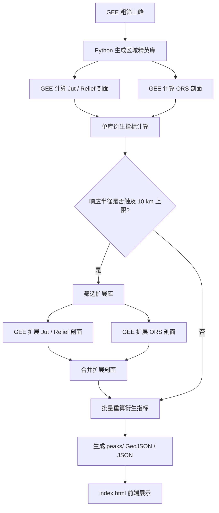
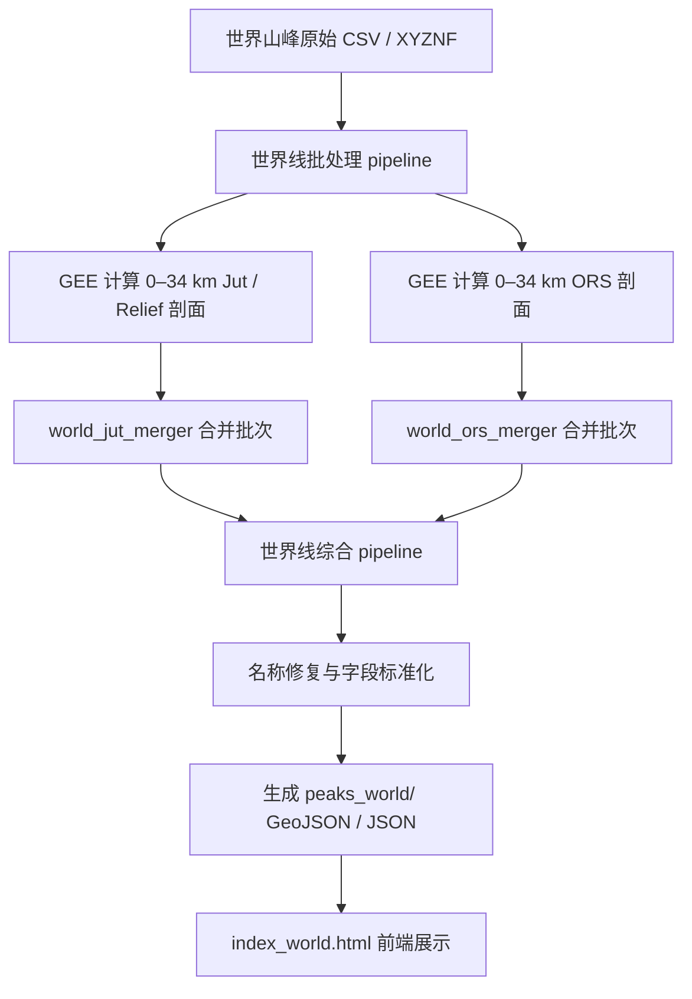

# RJA-Peaks · 国内与世界山峰多库综合地图

RJA-Peaks 是一个基于 **MapTiler SDK + Google Earth Engine + Python 预处理** 的交互式山峰地形显著度地图项目。项目目前包含两条彼此独立、并行维护的数据展示线：

1. **国内精英库线**：由 `index.html` 与 `peaks/` 驱动，面向北京周边及华北—华中—东北等国内区域精英山峰库。
2. **世界山峰库线**：由 `index_world.html` 与 `peaks_world/` 驱动，面向全球 Ribus/P1000、各大洲 J 系列库、高亚洲、东南亚、日本、朝鲜半岛、马来西亚等世界山峰库。

两条线在文件、数据目录和前端入口上相互独立，互不覆盖、互不替代。国内线继续保持原有 `index.html + peaks/` 结构；世界线新增 `index_world.html + peaks_world/` 结构。

**国内地图入口：** [https://Survinian.github.io/RJA-Peaks/](https://Survinian.github.io/RJA-Peaks/)

**世界地图入口：** [https://Survinian.github.io/RJA-Peaks/index_world.html](https://Survinian.github.io/RJA-Peaks/index_world.html)

---

## 项目定位

本项目试图在传统海拔、地形突起度和孤立度之外，进一步描述一个更主观但也更接近登山与观看经验的问题：

> 一座山是否在地形上表现出足够强的起伏、突起、独立性和视觉压迫感？

为此，项目不使用单一指标给出最终答案，而是保留多类互补指标：

- **Relief / 高差**：描述峰点周围的平均与最大起伏。
- **Jut / 突起度**：同时考虑高差与仰角，描述从周边地面仰望峰顶时的局部压迫感。
- **ATS / Absolute Topographic Sharpness / 绝对地形锐度**：由平均突起度与平均高差共同构成，带有长度量纲，用于描述综合锐度。
- **ORS / Omnidirectional Relief and Steepness / 全向高差-坡度指标**：基于全方向高差与坡度核函数的离散近似积分，用于补充刻画局部强陡峻结构。

本项目当前更适合被理解为一个**地形结构探索工具**，而非严格意义上的山峰美学或视觉感知模型。非视点依赖的地形指标不能完全解决“崖底悖论”：局部深谷或崖底的强高差不一定等同于人眼看见一座完整山体时的震撼感。后续若要进一步接近真实观看经验，需要引入视点依赖的天际线模拟与目标峰轮廓识别。

---

## 双线并行结构

```text
RJA-Peaks/
├─ index.html                 # 国内精英库地图入口
├─ peaks/                     # 国内精英库前端数据
├─ index_world.html           # 世界山峰库地图入口
├─ peaks_world/               # 世界山峰库前端数据
├─ README.md
└─ .gitignore
```

### 国内线

国内线沿用既有结构：

```text
index.html
peaks/
  output_beijing_geojson/
  output_bailixi_geojson/
  output_*_geojson/
```

该线用于展示北京周边库、百里溪库及国内各区域精英库。它继续使用原有 0–10 km 计算体系与国内版前端逻辑。

### 世界线

世界线新增独立结构：

```text
index_world.html
peaks_world/
  output_ribus_geojson/
  output_asia_j1000_geojson/
  output_europe_j1000_geojson/
  output_north_america_j800_geojson/
  output_south_america_j800_geojson/
  output_africa_j250_geojson/
  output_oceania_j250_geojson/
  output_antarctica_j250_geojson/
  output_highasia_e5800_p950_geojson/
  output_southeast_asia_gb_geojson/
  output_japan_100peaks_geojson/
  output_japan_j250_geojson/
  output_korea_j250_geojson/
  output_malaysia_prominence_110peaks_geojson/
```

世界线前端默认加载 **世界Ribus/P1000库**，其余库采用懒加载开关机制。世界线采用 0–34 km 全段统计，因此前端中使用 **34kmORS** 替代国内线的 10kmORS 表述。

---

## 数据库说明

### 国内线基础库

| 库名 | 覆盖范围 | 来源 |
|---|---|---|
| 北京周边库 | 北京市域及少量周边区域 | 个人标注 |
| 百里溪库 | 京津冀 | 前辈 **百里溪** 系列文章，特此致谢 🙏 |

### 国内线精英山峰库

国内精英库山峰通过 GEE 与 Python 多步自动筛选生成，覆盖北京周边、冀东、宣大、中太行、南太行、燕坝、察哈尔、赤峰、绥朔、吕梁山、汾沁、泰沂、胶东、阴山、潢坝、辽东、秦岭、长白山、伏牛山等区域。

### 世界线山峰库

| 库名 | 前端 key | 说明 |
|---|---|---|
| 世界Ribus/P1000库 | `ribus_p1000` | 全球 Ribus / P1000 级别山峰库，世界线默认唯一加载库。 |
| 亚洲J1000库 | `asia_j1000` | 亚洲 Jut 高阈值山峰库。 |
| 欧洲J1000库 | `europe_j1000` | 欧洲 Jut 高阈值山峰库。 |
| 北美洲J800库 | `north_america_j800` | 北美洲 Jut 高阈值山峰库。 |
| 南美洲J800库 | `south_america_j800` | 南美洲 Jut 高阈值山峰库。 |
| 非洲J250库 | `africa_j250` | 非洲 Jut 精选山峰库。 |
| 大洋洲J250库 | `oceania_j250` | 大洋洲 Jut 精选山峰库。 |
| 南极洲J250库 | `antarctica_j250` | 南极洲 Jut 精选山峰库；受 Web Mercator 投影限制，极点附近山峰可能无法在普通世界底图中完整显示。 |
| 高亚洲E5800&P950库 | `highasia_e5800_p950` | 高亚洲 5800m+ 海拔与 950m+ 突起度山峰库。 |
| 东南亚GB库 | `southeast_asia_gb` | 来源于 Gunung Bagging 体系整理的东南亚山峰库。 |
| 日本百名山库 | `japan_100peaks` | 日本百名山。 |
| 日本J250库 | `japan_j250` | 日本 Jut 精选山峰库。 |
| 朝鲜半岛J250库 | `korea_j250` | 韩国与朝鲜山峰。 |
| 马来西亚P110库 | `malaysia_prominence_110peaks` | 马来西亚前列突起度山峰库。 |

---

## 数据处理工作流

### 国内线流程



### 世界线流程



世界线与国内线的输入、输出目录相互独立。请不要把世界线输出写入 `peaks/`，也不要把国内线输出写入 `peaks_world/`。

---

## 指标体系

所有指标均在多个采样半径 `r` 下独立计算，形成完整径向剖面。国内线默认基础半径为 125 m–10,000 m；世界线默认统计至 34,000 m。

### 1. 基础起伏场

**平均高差**

$$R_{mean}(r)=\frac{1}{N_r}\sum_{i\in D_r}(Z_{peak}-Z_i)$$

**最大高差**

$$R_{max}(r)=\max_{i\in D_r}(Z_{peak}-Z_i)$$

**平均突起度**

$$J_{mean}(r)=\frac{1}{N_r}\sum_{i\in D_r}\frac{(Z_{peak}-Z_i)|Z_{peak}-Z_i|}{\sqrt{(Z_{peak}-Z_i)^2+d_i^2}}$$

**最大突起度**

$$J_{max}(r)=\max_{i\in D_r}\frac{(Z_{peak}-Z_i)|Z_{peak}-Z_i|}{\sqrt{(Z_{peak}-Z_i)^2+d_i^2}}$$

其中，`D_r` 表示以峰点为圆心、半径为 `r` 的采样圆，`d_i` 为采样点到峰点的水平距离。

### 2. 无量纲形态因子

| 字段 | 名称 | 公式 | 含义 |
|---|---|---|---|
| `CI_Cliff` | 极限绝壁度 CI | $J_{max}/R_{max}$ | 最强局部剖面的陡峭程度，接近 1 时类似垂直断崖。 |
| `GS_Steepness` | 全局陡峭度 GS | $J_{mean}/R_{max}$ | 平均突起度相对于最大高差的比例，表示整体陡峭性。 |
| `RF_ReliefFullness` | 高差饱满度 RF | $R_{mean}/R_{max}$ | 平均高差相对于最大高差的充分程度。 |
| `JF_JutFullness` | 突起饱满度 JF | $J_{mean}/J_{max}$ | 平均突起度相对于最大突起度的充分程度。 |

### 3. 综合地形锐度

**形态锐度指数 FSI**

$$FSI(r)=GS(r)\times RF(r)=\frac{J_{mean}(r)R_{mean}(r)}{[R_{max}(r)]^2}$$

**绝对地形锐度 ATS**

$$ATS(r)=FSI(r)\times R_{max}(r)=\frac{J_{mean}(r)R_{mean}(r)}{R_{max}(r)}$$

`ATS` 具有米的量纲。它不是单纯的最大高差指标，而是同时要求平均突起度与平均高差背景较高，并通过 `Rmax` 对单侧深谷或局部极端低值形成一定抑制。

### 4. 响应半径

| 字段 | 名称 | 公式 | 含义 |
|---|---|---|---|
| `R_Jmean_peak` | 平均突起响应半径 | $\arg\max_r J_{mean}(r)$ | 平均突起度达到峰值时的采样半径。 |
| `R_ATS_peak` | ATS峰值响应半径 | $\arg\max_r ATS(r)$ | ATS 达到峰值时的采样半径。 |
| `R_ATS_marginal` | ATS最大边际响应半径 | $\arg\max_r \Delta ATS/\Delta r$ | ATS 增速最快的相邻半径区间中点。 |

---

## ORS：全向高差-坡度指标

ORS 的理论基础来自 Earl 与 Metzler 提出的全向高差-坡度泛函。其核心思想是：对参考点周围所有方向上的样点，计算相对高度差与距离构成的坡度项，并通过特定角度归一化核函数进行积分，最终得到一个具有长度量纲的综合陡峻度指标。

理论形式可写作：

$$ORS_f(p,h_0;h)=\left[\iint_{\mathbb{R}^2} f^2\left(\frac{h_0-h(x)}{r}\right)dA(x)\right]^{1/2}$$

其中，$r=\|x-p\|$。当 $u=(h_0-h(x))/r\le 0$ 时，核函数贡献记为 0。

工程实现采用固定环带与极坐标分层采样：每个环带 `N_RADIAL = 5`、`N_ANGULAR = 20`，即每环 100 个样点。国内线主要使用 10 km ORS；世界线使用 34 km ORS。ORS 结果适合区域比较和前端展示，不应视为逐像元连续积分真值。

---

## 综合击败率

每座山峰的综合击败率 `rp` 是若干库内击败率的平均值。当前纳入的主要字段包括：

| 字段 | 含义 |
|---|---|
| `mean_relief_crp` | 多半径平均高差表现。 |
| `mean_jut_crp` | 多半径平均 Jut 表现。 |
| `mean_ats_crp` | 多半径平均 ATS 表现。 |
| `ors_10km_crp` / `ors_34km_crp` | 国内线 10 km ORS 或世界线 34 km ORS 表现。 |
| `max_jut_crp` | 最大 Jut 峰值表现。 |
| `max_ats_crp` | 最大 ATS 峰值表现。 |

击败率 = `1 - 排名百分位`，越接近 100% 表示在该库中越突出。各库独立排名，因此不同库之间的颜色和击败率主要表示库内相对表现。

---

## 前端功能

### 1. 多库叠加与图层控制

国内线和世界线均支持多库开关、库内综合排名着色、名称标签、当地名称/英文名称切换、点大小调整与总体表现筛选。

### 2. 山峰检索与定位

输入山峰名后可在候选列表中选择目标山峰，并自动定位到地图对应位置。

### 3. 总体表现筛选

可按高差、平均 Jut、ATS、ORS、最大 Jut、最大 ATS 等总体表现阈值筛除山峰。筛选逻辑为“满足任一条件即显示”。

### 4. 距离段突出筛选

右侧面板支持选择 Relief、Jut、ATS 或 ORS，并勾选一个或多个明确距离段。可设置“排名前 5%–50%”阈值，并选择任一段满足或所有段均满足。

### 5. 山峰弹窗

点击山峰后弹窗展示海拔、所属库、综合击败率、峰值指标、响应半径、分段击败率、Relief / Jut / ATS / ORS 径向曲线与排名变化。

### 6. 响应半径图层

可显示 Base 点、平均突起响应半径圆、ATS峰值响应半径圆、ATS最大边际响应半径圆，并分别控制透明度。

### 7. 总述图表

支持分布频率图与前 10 名柱状图。可选择一个或多个库，对全局字段或距离段字段进行统计与排序。

### 8. 3D 地形与底图

地图基于 MapTiler SDK 显示，可叠加三维地形。项目通过 Cloudflare Workers 代理 MapTiler API 请求，以避免在前端直接暴露 API Key。

---

## GitHub Pages 部署说明

本项目为静态网页项目。将以下文件与目录提交到仓库根目录后，即可通过 GitHub Pages 访问：

```text
index.html
peaks/
index_world.html
peaks_world/
README.md
.gitignore
```

推荐 `.gitignore` 至少放行以下内容：

```gitignore
*
!.gitignore
!README.md
!index.html
!index_world.html
!peaks/
!peaks/**
!peaks_world/
!peaks_world/**
```

本地预览时不要直接双击 `file:///.../index_world.html` 打开，应使用本地 HTTP 服务：

```powershell
cd D:\My_Programs\jutman\RJA-Peaks
python -m http.server 8000
```

然后访问：

```text
http://localhost:8000/
http://localhost:8000/index_world.html
```

---

## 上传世界线文件到 GitHub 的建议命令

以下命令假定本地仓库位于 `D:\My_Programs\jutman\RJA-Peaks`，当前世界线输出目录位于 `D:\My_Programs\jutman\peaks_world`，当前世界线前端文件位于 `D:\My_Programs\jutman\index_world.html`。

```powershell
cd D:\My_Programs\jutman\RJA-Peaks

git pull

# 复制世界线前端与数据目录，不影响 index.html 和 peaks/
Copy-Item D:\My_Programs\jutman\index_world.html .\index_world.html -Force
Copy-Item D:\My_Programs\jutman\peaks_world .\peaks_world -Recurse -Force

# 更新 README 和 .gitignore 后提交
git add index_world.html peaks_world README.md .gitignore
git commit -m "Add world peaks map alongside domestic map"
git push origin main
```

如果默认分支是 `master`，最后一行改为：

```powershell
git push origin master
```

---

## 方法限制

1. **视点无关性**：Relief、Jut、ATS 与 ORS 主要描述峰点周边地形场，并不等同于真实观察点上的视觉震撼。
2. **极值敏感性**：`Rmax`、`Jmax` 及其派生指标可能受到局部深沟、人工坑或 DEM 异常影响。
3. **响应半径不是地形边界**：`R_Jmean_peak` 与 `R_ATS_peak` 是指标曲线的峰值响应尺度，不应直接理解为山体真实边界。
4. **ORS 为工程化近似**：当前 ORS 使用环带分层采样而非逐像元连续积分，适合区域比较和前端展示，但不是严格数学真值。
5. **南极显示限制**：普通 Web Mercator 底图无法完整显示南纬约 85° 以南区域，因此南极库极区山峰在 `index_world.html` 中可能无法全部正常拖动查看。
6. **底图代理依赖**：前端依赖 Cloudflare Workers 代理 MapTiler 请求；若 Worker 或 MapTiler 权限异常，可能出现底图 `403` 或加载失败。

---

## 致谢

- 百里溪库数据来源于前辈 **百里溪** 多年积累的系列山峰记录文章，感谢其无私分享。
- Jut 指标的概念由 **Kai Xu** 提出，感谢其开创性工作，感谢 PeakJut 网站为全球山峰爱好者带来的探索享受。
- ORS 理论参考：**Edward Earl & David Metzler**, *A new topographic functional*。
- 感谢 GitHub 贡献者 Apiaceae 的开源项目 [geocoder](https://github.com/Apiaceae/geocoder)，为部分无名峰真实山名修正提供了数据参考。
- 感谢高德地图、天地图、两步路、六只脚及各位户外爱好者提供的山峰地名、轨迹与标注点参考。
- 部分世界山峰列表参考 Worldribus、Peakjut、Peaklist、Gunung Bagging、日本百名山等公开山峰资料整理。
- 高程数据来源：JAXA ALOS AW3D30 V4.1。
- 地形计算平台：Google Earth Engine。
- 地图底图及地形数据：MapTiler。
- API 代理服务：Cloudflare Workers。
- AI 辅助理论探索及编程服务：Claude、Gemini、ChatGPT。
