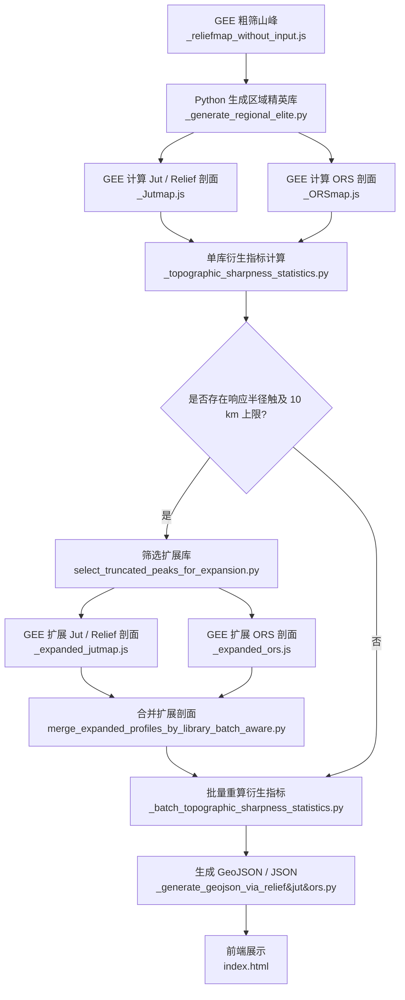

# RJA-Peaks · 北京周边山峰多库综合地图

一个基于 **MapTiler SDK + Google Earth Engine + Python 预处理** 的交互式山峰地形显著度地图。项目整合北京及周边多个山峰数据库，并以多半径 Relief、Jut、ATS 与 ORS 剖面为基础，支持山峰检索、分库显示、距离段筛选、响应半径可视化、弹窗剖面图与总述统计图表。

**在线访问：** [https://Survinian.github.io/RJA-Peaks/](https://Survinian.github.io/RJA-Peaks/)

---

## 项目定位

本项目试图在传统海拔、地形突起度和孤立度之外，进一步描述一个更主观但也更接近登山与观看经验的问题：

> 一座山是否在地形上表现出足够强的起伏、突起、独立性和视觉压迫感？

为此，项目不使用单一指标给出最终答案，而是保留多类互补指标：

- **Relief / 高差**：描述峰点周围的平均与最大起伏。
- **Jut / 突起度**：同时考虑高差与仰角，描述从周边地面仰望峰顶时的局部压迫感。
- **ATS / Absolute Topographic Sharpness / 绝对地形锐度**：由平均突起度与平均高差共同构成，带有长度量纲，用于描述综合锐度。
- **ORS / Omnidirectional Relief and Steepness / 全向高差-坡度指标**：基于全方向高差与坡度核函数的离散近似积分，用于补充刻画局部强陡峻结构。

本项目当前更适合被理解为一个**地形结构探索工具**，而非严格意义上的山峰美学或视觉感知模型。尤其是，非视点依赖的地形指标不能完全解决“崖底悖论”：局部深谷或崖底的强高差不一定等同于人眼看见一座完整山体时的震撼感。后续若要进一步接近真实观看经验，需要引入视点依赖的天际线模拟与目标峰轮廓识别。

---

## 数据库说明

### 基础库

| 库名 | 覆盖范围 | 来源 |
|---|---|---|
| 北京周边库 | 北京市域及少量周边区域 | 个人标注 |
| 百里溪库 | 京津冀 | 前辈 **百里溪** 系列文章，特此致谢 🙏 |

### 精英山峰库

精英库山峰通过 GEE 与 Python 多步自动筛选生成，覆盖以下区域：

| 库名 | 经度范围 | 纬度范围 | 范围备注 | 标注色 |
|---|---:|---:|---|---|
| 北京周边精英库 | 114.5°E–118.0°E | 39.0°N–41.2°N | — | 红 |
| 冀东精英库 | 118.0°E–121.5°E | 39.0°N–41.2°N | — | 橙 |
| 宣大精英库 | 113.0°E–114.5°E | 39.0°N–41.2°N | — | 棕 |
| 中太行精英库 | 113.0°E–114.5°E | 37.0°N–39.0°N | — | 粉红 |
| 南太行精英库 | 113.0°E–114.5°E | 35.0°N–37.0°N | — | 橙红 |
| 燕坝精英库 | 114.5°E–118.0°E | 41.2°N–43.2°N | — | 绿 |
| 察哈尔精英库 | 113.0°E–114.5°E | 41.2°N–43.2°N | — | 深青 |
| 赤峰精英库 | 118.0°E–122.0°E | 41.2°N–43.2°N | — | 紫灰 |
| 绥朔精英库 | 111.0°E–113.0°E | 39.0°N–41.2°N | — | 红灰 |
| 吕梁山精英库 | 111.0°E–113.0°E | 37.0°N–39.0°N | — | 青蓝 |
| 汾沁精英库 | 110.2°E–113.0°E | 34.7°N–37.0°N | 去除 (110.2°E–110.5°E, 35.0°N–37.0°N) 片区 | 橙灰 |
| 泰沂精英库 | 116.0°E–119.6°E | 34.8°N–37.0°N | — | 紫 |
| 胶东精英库 | 119.6°E–122.8°E | 35.5°N–38.5°N | — | 蓝 |
| 阴山精英库 | 108.5°E–111.0°E | 40.2°N–42.2°N | — | 黄褐 |
| 潢坝精英库 | 117.0°E–120.0°E | 43.2°N–45.2°N | — | 灰绿 |
| 辽东精英库 | 121.0°E–124.5°E | 38.5°N–41.8°N | 去除 (121.0°E–122.0°E, 41.2°N–41.8°N) 片区 | 灰蓝 |
| 秦岭精英库 | 106.0°E–111.0°E | 33.0°N–34.6°N | — | 水绿 |
| 长白山精英库 | 124.5°E–128.3°E | 40.0°N–43.0°N | 去除中国国境线外地区 | 灰 |
| 伏牛山精英库 | 111.0°E–114.0°E | 33.0°N–34.7°N | — | 金黄 |

---

## 数据处理工作流



简化步骤说明：

1. 使用 GEE 在研究区内粗筛局部极大值峰点。
2. 使用 Python 脚本进行命名匹配、重复点清理、机器学习过滤与精英库筛选。
3. 使用 GEE 分别计算各山峰的 Jut / Relief 剖面与 ORS 剖面。
4. 使用 `_topographic_sharpness_statistics.py` 计算单库衍生指标与响应半径。
5. 若 `R_Jmean_peak` 或 `R_ATS_peak` 触及 10 km 上限，则筛选进入扩展库。
6. 使用 `_expanded_jutmap.js` 与 `_expanded_ors.js` 对扩展库重新计算更大半径剖面。
7. 合并扩展剖面后，使用 `_batch_topographic_sharpness_statistics.py` 批量重算衍生指标。
8. 使用 `_generate_geojson_via_relief&jut&ors.py` 汇总为前端可读取的 GeoJSON / JSON。
9. 前端 `index.html` 负责地图展示、筛选、弹窗、图表与响应半径图层。

---

## 指标体系

所有指标均在多个采样半径 `r` 下独立计算，形成完整径向剖面。默认基础半径范围为 125 m–10,000 m；触及上限的山峰可进入扩展流程，计算至更大半径。

### 1. 基础起伏场

**平均高差**

$$R_{mean}(r)=\frac{1}{N_r}\sum_{i\in D_r}(Z_{peak}-Z_i)$$

**最大高差**

$$R_{max}(r)=\max_{i\in D_r}(Z_{peak}-Z_i)$$

**平均突起度**

$$J_{mean}(r)=\frac{1}{N_r}\sum_{i\in D_r}\frac{(Z_{peak}-Z_i)|Z_{peak}-Z_i|}{\sqrt{(Z_{peak}-Z_i)^2+d_i^2}}$$

**最大突起度**

$$J_{max}(r)=\max_{i\in D_r}\frac{(Z_{peak}-Z_i)|Z_{peak}-Z_i|}{\sqrt{(Z_{peak}-Z_i)^2+d_i^2}}$$

其中，`D_r` 表示以峰点为圆心、半径为 `r` 的采样圆，`d_i` 为采样点到峰点的水平距离。

### 2. 无量纲形态因子

| 字段 | 名称 | 公式 | 含义 |
|---|---|---|---|
| `CI_Cliff` | 极限绝壁度 CI | $J_{max}/R_{max}$ | 最强局部剖面的陡峭程度，接近 1 时类似垂直断崖。 |
| `GS_Steepness` | 全局陡峭度 GS | $J_{mean}/R_{max}$ | 平均突起度相对于最大高差的比例，表示整体陡峭性。 |
| `RF_ReliefFullness` | 高差饱满度 RF | $R_{mean}/R_{max}$ | 平均高差相对于最大高差的充分程度，可视为相对独立性或高差分布均匀性。 |
| `JF_JutFullness` | 突起饱满度 JF | $J_{mean}/J_{max}$ | 平均突起度相对于最大突起度的充分程度，用于识别突起是否由少数极端点支配。 |

> 旧命名中的 `SL_Slender` 与 `SF_Spire` 已不再作为正式字段使用。新体系中，`RF_ReliefFullness` 更准确地描述 `Rmean/Rmax`，`JF_JutFullness` 更准确地描述 `Jmean/Jmax`。

### 3. 综合地形锐度

**形态锐度指数 FSI**

$$FSI(r)=GS(r)\times RF(r)=\frac{J_{mean}(r)R_{mean}(r)}{[R_{max}(r)]^2}$$

**绝对地形锐度 ATS**

$$ATS(r)=FSI(r)\times R_{max}(r)=\frac{J_{mean}(r)R_{mean}(r)}{R_{max}(r)}$$

`ATS` 具有米的量纲。它不是单纯的最大高差指标，而是同时要求平均突起度与平均高差背景较高，并通过 `Rmax` 对单侧深谷或局部极端低值形成一定抑制。因此，高 `ATS` 往往更偏向识别整体独立、面状展开的山峰，而不是只靠一侧深谷制造巨大落差的山峰。

### 4. 响应半径

本项目将原先容易被误解为“地形边界”的半径统一改称为**响应半径**。它们描述的是某条径向指标曲线的特征尺度，而不是严格山体边界。

| 字段 | 名称 | 公式 | 含义 |
|---|---|---|---|
| `R_Jmean_peak` | 平均突起响应半径 | $\arg\max_r J_{mean}(r)$ | 平均突起度达到峰值时的采样半径。 |
| `R_ATS_peak` | ATS峰值响应半径 | $\arg\max_r ATS(r)$ | ATS 达到峰值时的采样半径。 |
| `R_ATS_marginal` | ATS最大边际响应半径 | $\arg\max_r \Delta ATS/\Delta r$ | ATS 增速最快的相邻半径区间中点，更接近“综合锐度开始快速展开”的位置。 |

`R_ATS_marginal` 的离散计算方式为：

$$G_{ATS}(k)=\frac{ATS(r_k)-ATS(r_{k-1})}{r_k-r_{k-1}}$$

$$R_{ATS\_marginal}=\frac{r_{k^*}+r_{k^*-1}}{2},\quad k^*=\arg\max_k G_{ATS}(k)$$

为避免极弱山峰因微小数值波动输出无意义半径，当前流程要求最大边际响应区间两端 ATS 绝对值的平均值不低于 1 m；不满足条件时不输出 `R_ATS_marginal`。

---

## ORS：全向高差-坡度指标

ORS 的理论基础来自 Earl 与 Metzler 提出的全向高差-坡度泛函。其核心思想是：对参考点周围所有方向上的样点，计算相对高度差与距离构成的坡度项，并通过特定角度归一化核函数进行积分，最终得到一个具有长度量纲的综合陡峻度指标。

理论形式可写作：

$$ORS_f(p,h_0;h)=\left[\iint_{\mathbb{R}^2} f^2\left(\frac{h_0-h(x)}{r}\right)dA(x)\right]^{1/2}$$

其中，$r=\|x-p\|$。当 $u=(h_0-h(x))/r\le 0$ 时，核函数贡献记为 0。该指标本质上是对“高差 × 坡度”信息的全方向综合。

### 工程化实现

由于完整逐像元连续积分计算量极大，本项目采用可批量运行的离散近似：

1. 将 0–10 km 拆分为 48 个同心环带：125–2,000 m 每 125 m 一个环带，2,250–10,000 m 每 250 m 一个环带。
2. 每个环带采用固定极坐标分层采样：`N_RADIAL = 5`，`N_ANGULAR = 20`，即每环 100 个样点。
3. 每个样点按环带面积赋权，累计 `kernel_sq × point_weight_m2`，得到 ORS² 增量与累计 ORS。
4. 采样前投影到 UTM 米制坐标系，避免经纬度距离失真。
5. 峰顶高程可使用峰点附近 buffer 最大值修正，以降低 DEM 像元错位影响。
6. 中心设置最小距离阈值，避免 `r → 0` 附近数值爆炸。
7. 不预先掩膜高于峰点的地形，而是由 ORS 核函数中的 `u.max(0)` 令其贡献为 0。
8. 通过批量导出控制 GEE 任务规模。

因此，前端中的 `10kmORS`、ORS 分段表现和 ORS 排名应理解为**面向区域大样本比较的离散近似 ORS**，适合排序、筛选和与 Relief / Jut / ATS 互补对照，不应被视为逐像元精确积分真值。

---

## 综合击败率

每座山峰的综合击败率 `rp` 是若干库内击败率的平均值。当前纳入的主要字段包括：

| 字段 | 含义 |
|---|---|
| `mean_relief_crp` | 多半径平均高差表现。 |
| `mean_jut_crp` | 多半径平均 Jut 表现。 |
| `mean_ats_crp` | 多半径平均 ATS 表现。 |
| `ors_10km_crp` | 10 km ORS 库内表现。 |
| `max_jut_crp` | 最大 Jut 峰值表现。 |
| `max_ats_crp` | 最大 ATS 峰值表现。 |

击败率 = `1 - 排名百分位`，越接近 100% 表示在该库中越突出。各库独立排名，因此不同库之间的颜色和击败率主要表示库内相对表现。

---

## 距离段定义

为避免“极短距离 / 长距离”等描述带来主观歧义，当前版本使用明确的半径范围作为距离段名称：

| 距离段字段名 | 采样半径范围 |
|---|---|
| `125 m - 500 m` | 125 m–500 m |
| `625 m - 1250 m` | 625 m–1,250 m |
| `1375 m - 2000 m` | 1,375 m–2,000 m |
| `2250 m - 3500 m` | 2,250 m–3,500 m |
| `3750 m - 5000 m` | 3,750 m–5,000 m |
| `5250 m - 7000 m` | 5,250 m–7,000 m |
| `7250 m - 10000 m` | 7,250 m–10,000 m |

前端距离段筛选支持 Relief、Jut、ATS 与 ORS。分段表现通常来自该半径范围内对应指标的均值排名或击败率。

---

## 前端功能

### 1. 多库叠加与图层控制

左侧面板可独立开关北京周边库、百里溪库和各区域精英库。每个库使用独立色系，点颜色表示库内综合排名百分率。名称标签、点大小、未扩展山峰隐藏、外卡山峰隐藏等显示选项均可实时调整。

### 2. 山峰检索与定位

前端提供山峰名称模糊搜索。输入山峰名或无名峰编号后，可在候选列表中选择目标山峰，并自动定位到地图对应位置。

### 3. 总体表现筛选

可按以下总体表现阈值筛除山峰：

- 高差总体表现
- 平均 Jut 总体表现
- ATS 总体表现
- 10kmORS 表现
- 最大 Jut 峰值表现
- 最大 ATS 峰值表现

这些筛选项采用“满足任一条件即显示”的并集逻辑，适合快速寻找某一维度特别突出的山峰。

### 4. 距离段突出筛选

右侧面板支持选择 Relief、Jut、ATS 或 ORS，并勾选一个或多个明确距离段。可设置“排名前 5%–50%”阈值，并选择：

- 任一段满足：只要某个选中距离段突出即显示。
- 所有段均满足：必须在所有选中距离段都突出才显示。

该功能用于寻找特定尺度上表现突出的山峰，例如“2,250 m - 3,500 m 范围 ATS 特别高”的山峰。

### 5. 山峰弹窗

点击山峰后弹窗展示：

- 山名、所属库、海拔、综合击败率
- 高差、Jut、ATS、ORS 的总体表现
- 10kmORS、ORS 最佳排名及对应半径
- 最大 Jut、最大平均 Jut、最大 ATS
- `R_Jmean_peak`、`R_ATS_peak`、`R_ATS_marginal`
- Relief / Jut / ATS / ORS 分段击败率条形图
- Relief / Jut / ATS / ORS 径向曲线与排名变化折线图

### 6. 响应半径图层

前端提供响应半径图层开关：

- **Base 点**：显示 Jut 最大贡献点。
- **平均突起响应半径圆**：对应 `R_Jmean_peak`。
- **ATS峰值响应半径圆**：对应 `R_ATS_peak`。
- **ATS最大边际响应半径圆**：对应 `R_ATS_marginal`，仅在满足最小 ATS 强度阈值时显示。

三个半径圆可分别控制透明度，用于观察山峰多尺度响应范围。

### 7. 总述图表

“总述图表”弹窗支持两类图表模式：

- **分布频率图**：查看所选库在某个全局字段或分段字段上的数值分布。
- **前 10 名柱状图**：选择库、字段和距离段后，输出对应条件下排名前 10 的山峰。

若选择多个库，前端会将所选库合并后统一排序，并在山名旁标注所属库。若选择分段指标，则会按选中距离段内的指标均值进行排序。

### 8. 3D 地形与底图

地图基于 MapTiler SDK 显示，可叠加三维地形。项目通过 Cloudflare Workers 代理 MapTiler API 请求，以避免在前端直接暴露 API Key。

---

## 输出文件结构

```text
index.html                                  主地图文件
peaks/
  output_beijing_geojson/                   北京周边库输出
  output_bailixi_geojson/                   百里溪库输出
  output_*_geojson/                         各区域精英库输出
```

每个 `output_*_geojson` 目录通常包含：

| 文件 | 作用 |
|---|---|
| `peaks_*.geojson` | 山峰主点层，包含主要属性、总体击败率、分段击败率和径向曲线字段。 |
| `*_jut_bases.geojson` | Jut 最大贡献点 / Base 点。 |
| `*_jut_profiles.json` | 各山峰多半径 Jut / Relief 剖面。 |
| `*_jmean_peak_circles.geojson` | 平均突起响应半径圆。 |
| `*_ats_peak_circles.geojson` | ATS峰值响应半径圆。 |
| `*_ats_marginal_circles.geojson` | ATS最大边际响应半径圆。 |

---

## 主要脚本

| 脚本 | 作用 |
|---|---|
| `_reliefmap_without_input.js` | 在 GEE 中粗筛候选峰，并计算基础高差统计。 |
| `_generate_regional_elite.py` | 生成区域精英库，含命名匹配、ML 过滤、双步筛选与外卡通道。 |
| `_Jutmap.js` | 在 GEE 中计算 0–10 km Jut / Relief 多半径剖面。 |
| `_ORSmap.js` | 在 GEE 中计算 0–10 km ORS 环带剖面。 |
| `_topographic_sharpness_statistics.py` | 单库计算 RF、JF、FSI、ATS 与响应半径。 |
| `select_truncated_peaks_for_expansion.py` | 筛选响应半径触及 10 km 上限、需要扩展计算的山峰。 |
| `_expanded_jutmap.js` | 在 GEE 中计算扩展半径 Jut / Relief 剖面。 |
| `_expanded_ors.js` | 在 GEE 中计算扩展半径 ORS 剖面。 |
| `merge_expanded_profiles_by_library_batch_aware.py` | 将扩展结果按库合并回原始剖面。 |
| `_batch_topographic_sharpness_statistics.py` | 对所有库批量重算衍生指标。 |
| `_generate_geojson_via_relief&jut&ors.py` | 汇总 CSV，生成前端 GeoJSON / JSON。 |
| `_batch_generate_geojson.py` | 批量调用 GeoJSON 生成脚本。 |
| `index.html` | 前端地图、筛选、弹窗、图表与图层展示。 |

---

## 方法限制

本项目的核心限制包括：

1. **视点无关性**：Relief、Jut、ATS 与 ORS 主要描述峰点周边地形场，并不等同于真实观察点上的视觉震撼。崖底、深沟或墙状地形可能产生高指标值，但未必对应完整山体感知。
2. **极值敏感性**：`Rmax`、`Jmax` 及其派生指标可能受到局部深沟、人工坑或 DEM 异常影响。当前通过 DEM 平滑、区块尺度和响应半径诊断降低其影响，但没有完全消除。
3. **响应半径不是地形边界**：`R_Jmean_peak` 与 `R_ATS_peak` 是指标曲线的峰值响应尺度，不应直接理解为山体真实边界。`R_ATS_marginal` 在理想几何模型中可能更接近边界响应，但在复杂地形中仍可能对应外部结构进入采样圆的半径。
4. **ORS 为工程化近似**：当前 ORS 使用环带分层采样而非逐像元连续积分，适合区域比较和前端展示，但不是严格数学真值。

---

## 致谢

- 百里溪库数据来源于前辈 **百里溪** 多年积累的系列山峰记录文章，感谢其无私分享。
- Jut 指标的概念由 **Kai Xu** 提出，感谢其开创性工作，感谢 PeakJut 网站为全球山峰爱好者带来的探索享受。
- ORS 理论参考：**Edward Earl & David Metzler**, *A new topographic functional*。
- 感谢 GitHub 贡献者 Apiaceae 的开源项目 [geocoder](https://github.com/Apiaceae/geocoder)，为部分无名峰真实山名修正提供了数据参考。
- 感谢高德地图、天地图、两步路、六只脚及各位户外爱好者提供的山峰地名、轨迹与标注点参考。
- 高程数据来源：JAXA ALOS AW3D30 V4.1。
- 地形计算平台：Google Earth Engine。
- 地图底图及地形数据：MapTiler。
- API 代理服务：Cloudflare Workers。
- AI 辅助理论探索及编程服务：Claude、Gemini、ChatGPT。

